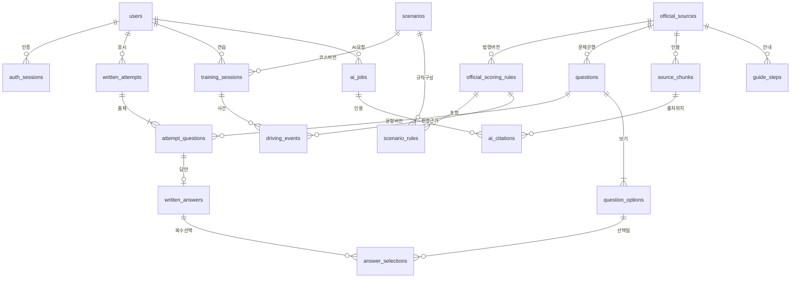

# ERD 제안

승인 검토용 DBML: `제출/design.dbml`. FUNCTION/ROAD는 같은 구조를 가지므로 training_sessions를 공통으로 사용하고 scenarios.kind로 구분한다. 별도 practice_sessions/road_sessions 중복 테이블을 만들지 않는다.

## 무결성 계약

- 문항/보기/법령/코스 버전은 공개 이후 수정하지 않고 새 ID로 발행. 사용 중인 버전 삭제 금지.
- 중복 이메일은 소문자·정규화 정책을 고정한 뒤 unique. 비밀번호 해시·세션 토큰 해시는 응답에 노출하지 않는다.
- 선택 option은 해당 attempt_question의 question 소속이어야 한다. 기본 FK만으로 강제되지 않으므로 트랜잭션 검증/복합 FK로 구현 시 확정한다.
- 답안 제출·최종 채점은 한 트랜잭션. SUBMITTED 재제출은 같은 결과 반환, 다른 내용 수정은409.
- official_scoring_rules: 실격이면 deduction_points NULL, 감점이면 양수. enabled=true는 support=A이며 검증된 detector_version 필수. 기능 연습 사건은 rule_id 없이 기록 가능.
- 세션의 rule 목록은 불변 scenario_rules로 고정. driving_events.rule_id는 해당 세션 코스에 포함된 규칙이어야 한다.
- AI의 answer_id는 같은 사용자 답안만 허용. citations는 승인된 source_chunks만 연결.
- effective_to는 exclusive, NULL이면 종료일 없음. 새 법령 검수 시 이전 버전 종료일 기록.
- 점수·판정은 서버 계산. 함수 연습 score/outcome은 NULL이고 통계만 표시. ROAD의 검증 실패도 score NULL/UNVERIFIED.
- score 0–100 표시는 제품 표시 정책이며 원시 감점 합계는 사건으로 보존. 이것을 법령의 최저점 규정으로 주장하지 않는다.
- JSON: calibration_snapshot={offset,inverted,turn_threshold,return_threshold,protocol_version}; input_log={engine_version,frames:[{seq,t_ms,steering,drive}]}; evidence={position,speed_kmh,zone_id,signal_state,frame_seq}; ai evidence_snapshot={attempt_ids,session_ids,category_stats,coverage,source_ids}.
- JSON의 구체적 스키마·크기·보관 기간·삭제 정책은 구현 전 명세 확정 게이트. 원시 센서 값을 무기한 저장하지 않는다.

## 아직 검증하지 않은 것

DBML 도구 렌더, SQL 마이그레이션·CHECK/복합FK 실행은 미실행. 실제 DB를 만들지 않았다. 이는 관계와 영속 필드를 검토하기 위한 초안이다.
