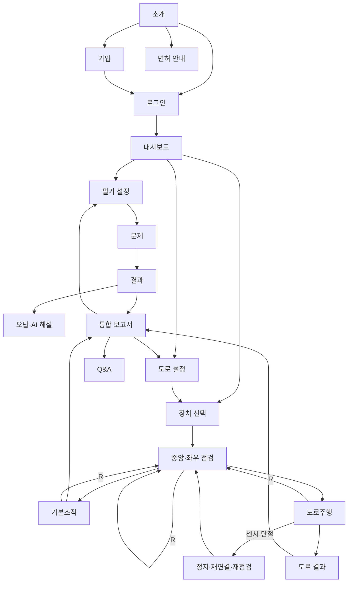

# UI 흐름 — 승인 검토안

실제 화면 구현 전 와이어프레임이다. `ui-wireframes.html`에서 17개 화면의 콘텐츠·버튼·상태·오류를 검토할 수 있다. 아직 최종 PDF에 삽입되지 않았다.

셋업 화면은 returnTo와 scenario_id를 앱 상태로 유지한다. 새로고침으로 이 값이 없으면 대시보드/코스 선택으로 돌아간다. 단절 후 기존 주행의 자동 재개는 하지 않고 다시 점검한 새 시도로 기록한다.

## 공통 동작

로그인 성공 후 원래의 보호 화면으로 이동하되 내부 경로만 허용한다. 실패한 폼은 비밀번호를 제외한 값을 유지한다. 주행 결과 저장 실패 때 재시도 데이터는 동일 세션 ID로 보존하며 성공 전 ‘저장 완료’로 표시하지 않는다. API timeout은 자동 재시도해 중복 세션/AI 작업을 만들지 않도록 요청 ID를 사용한다.

## S01 서비스 소개 `/`

- 표시/입력: 필기·주행 통합 학습 / 실차교육을 대체하지 않는 보조 도구
- 버튼/조작: 학습 시작; 면허 절차 보기
- 오류: 안내 로딩 실패: 원문 링크
- API: GET /guide
- 저장/상태: guide_steps,official_sources
- 이동: S02,S03,S05

## S02 회원가입 `/signup`

- 표시/입력: 이메일 [입력]; 비밀번호 [입력]; 닉네임 [입력]; 1종/2종 보통 [선택]
- 버튼/조작: 가입; 로그인으로
- 오류: 400 형식 오류 /409 이메일 중복: 입력 유지
- API: POST /auth/signup
- 저장/상태: users
- 이동: S03

## S03 로그인 `/login`

- 표시/입력: 이메일 [입력]; 비밀번호 [입력]
- 버튼/조작: 로그인; 회원가입
- 오류: 401 로그인 정보 확인 /429 잠시 후 재시도
- API: POST /auth/login
- 저장/상태: users,auth_sessions
- 이동: S04,S02

## S04 대시보드 `/dashboard`

- 표시/입력: 닉네임; 면허종별; 필기 응시 수; 최근 점수; 연습 목록; AI 추천 상태
- 버튼/조작: 필기 시작; 기본조작; 도로 연습; AI 보고서; 로그아웃
- 오류: 401 로그인 이동 /기록 없음: 첫 학습 안내
- API: GET /me; GET /dashboard; POST /auth/logout
- 저장/상태: users,written_attempts,training_sessions,ai_jobs
- 이동: S06,S10,S13,S16,S03

## S05 면허 취득 안내 `/license-guide`

- 표시/입력: 교육→신체검사→학과→기능→연습면허→도로주행→발급; 출처·시행일·조회일
- 버튼/조작: 면허 종류 선택; 공식 원문 열기; 학습 시작
- 오류: 출처 미확인: 해당 안내 비공개, 원문 링크
- API: GET /guide?license_type=...
- 저장/상태: guide_steps,official_sources
- 이동: S06,S01

## S06 필기 연습 설정 `/written`

- 표시/입력: 면허종별; 주제; 연습/모의시험; 문제 출처 구분; 데이터 버전
- 버튼/조작: 연습 시작; 대시보드
- 오류: 503 검수 문제 없음 /409 모의시험 미지원 버전
- API: GET /written/catalog; POST /written/attempts
- 저장/상태: categories,questions,written_attempts,attempt_questions
- 이동: S07,S04

## S07 필기 문제 `/written/{id}`

- 표시/입력: 문항 본문; 이미지; 보기; 선택 개수; 진행/남은 시간(앱 상태)
- 버튼/조작: 이전; 다음; 답안 저장; 최종 제출
- 오류: 저장 실패: 선택 보존·재시도 /409 이미 제출: 결과 이동
- API: GET /written/attempts/{id}; PUT /written/attempts/{id}/answers/{questionId}; POST /written/attempts/{id}/submit
- 저장/상태: attempt_questions,questions,question_options,written_answers,answer_selections
- 이동: S08

## S08 필기 결과 `/written/result/{id}`

- 표시/입력: 점수/총점; 정답 수; 문제별 결과; 출처; 연습은 합격 판정 없음
- 버튼/조작: 오답 보기; 새 연습; 보고서
- 오류: 404 본인 결과 없음 /결과 조회 실패 재시도
- API: GET /written/attempts/{id}/result
- 저장/상태: written_attempts,written_answers,questions
- 이동: S09,S06,S16

## S09 오답·AI 해설 `/written/review/{answerId}`

- 표시/입력: 문제; 내 선택; 검수 정답; 공식 해설; AI 설명; 인용 링크
- 버튼/조작: AI 해설 요청; 다시 조회; 결과로
- 오류: AI 실패: 공식 해설 유지 /근거 부족: 답변 유보
- API: GET /written/answers/{id}; POST /ai/jobs; GET /ai/jobs/{id}
- 저장/상태: written_answers,answer_selections,question_options,ai_jobs,ai_citations,source_chunks
- 이동: S08

## S10 센서 연결 `/controller`

- 표시/입력: 연결 상태(기기); 센서/키보드 [선택]; 지원 브라우저 안내
- 버튼/조작: 장치 연결; 키보드 사용; 대시보드
- 오류: 미지원·권한 거절·포트 점유: 키보드 선택
- API: 브라우저 Web Serial; 서버 API 없음
- 저장/상태: 앱/센서 상태만
- 이동: S11,S04

## S11 중앙·좌우 점검 `/controller/setup`

- 표시/입력: CENTER / STOP; 3초 안정 측정; LEFT 확인; CENTER; RIGHT 확인; CENTER; READY
- 버튼/조작: 방향 반전; R 다시 점검; 시작(READY만)
- 오류: 불안정: 카운트 다시 /단절: 연결 화면
- API: 브라우저 로컬 상태; 시작 시 POST /training/sessions
- 저장/상태: training_sessions.calibration_snapshot
- 이동: S12 또는 S14,S10

## S12 기본조작 연습 `/practice`

- 표시/입력: 전진/정지/후진; LEFT/CENTER/RIGHT; 기본 주행 화면; 연습 사건 목록
- 버튼/조작: 키보드 모드 W/S 전진·후진, A/D 조향; 센서 모드 방향키 위/아래 전진·후진, MPU 조향; R 재시작; 일시정지; 종료
- 오류: 단절·blur: 즉시 정지/일시정지; 저장 실패: 재시도
- API: POST /training/sessions; POST /training/sessions/{id}/complete; POST /training/sessions/{id}/abort
- 저장/상태: training_sessions,driving_events
- 이동: S11,S16,S04

## S13 도로 연습 설정 `/road`

- 표시/입력: 코스; 판정 규칙 버전; A/B/C 지원 목록; 일부 기준 평가 안내
- 버튼/조작: 컨트롤러 점검 후 시작; 기준 보기
- 오류: 검증된 자동 규칙 없음: 정보/연습 모드만
- API: GET /scenarios?kind=ROAD; GET /scenarios/{id}/rules
- 저장/상태: scenarios,scenario_rules,official_scoring_rules,official_sources
- 이동: S10,S11

## S14 도로주행 시뮬레이션 `/road/session/{id}`

- 표시/입력: 주행 화면; 속도; 제한속도; 신호; 진행; 지원 규칙 점수(검증 전 잠정)
- 버튼/조작: 키보드 모드 W/S/A/D; 센서 모드 방향키 위/아래와 MPU 조향; R; 일시정지; 종료
- 오류: 실격: 즉시 정지→결과 /단절: 일시정지 /저장 실패: 미저장 표시
- API: POST /training/sessions; POST /training/sessions/{id}/complete; POST /training/sessions/{id}/abort
- 저장/상태: training_sessions,scenarios,driving_events
- 이동: S15,S11

## S15 도로 결과 `/road/result/{id}`

- 표시/입력: 검증 상태; 점수; PASS/FAIL/DISQUALIFIED; 감점 목록; 실격 사유; 미측정 항목
- 버튼/조작: 재연습; 사건 근거 보기; AI 보고서
- 오류: UNVERIFIED: 점수 숨김 /저장 실패: 재전송
- API: GET /training/sessions/{id}
- 저장/상태: training_sessions,driving_events,official_scoring_rules,official_sources
- 이동: S13,S16

## S16 AI 통합 학습 보고서 `/report`

- 표시/입력: 취약영역; 실제 분자/분모; 근거 응시/세션; 추천 주제·다음 연습; 출처
- 버튼/조작: 보고서 생성; 상태 새로고침; 추천 연습
- 오류: 기록 부족 /AI timeout /근거 없는 주장은 노출하지 않음
- API: POST /ai/jobs; GET /ai/jobs/{id}; GET /ai/jobs?kind=REPORT
- 저장/상태: ai_jobs,ai_citations,written_attempts,written_answers,training_sessions,driving_events
- 이동: S06,S13,S17

## S17 공식 근거 Q&A `/assistant`

- 표시/입력: 질문 [입력]; 답변; 법령 시행일; 인용 위치
- 버튼/조작: 질문 보내기; 원문 열기; 대시보드
- 오류: INSUFFICIENT_EVIDENCE: 확인 가능한 근거 없음 /timeout 재시도
- API: POST /ai/jobs; GET /ai/jobs/{id}
- 저장/상태: ai_jobs,ai_citations,source_chunks,official_sources
- 이동: S04
